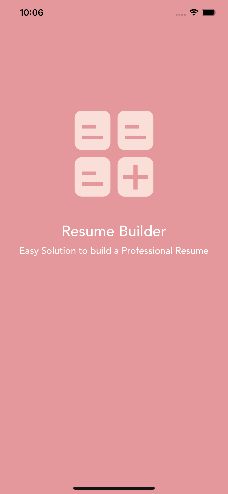
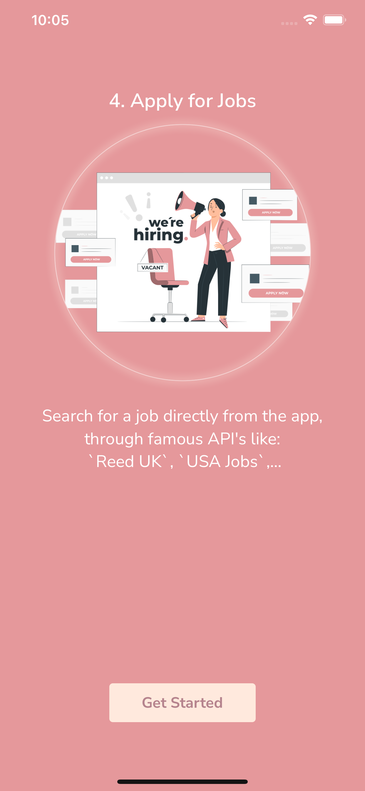
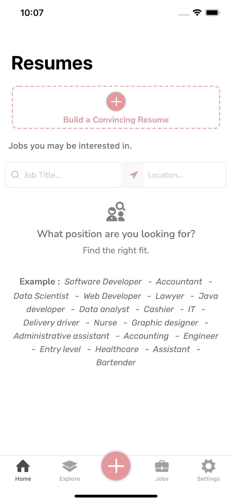
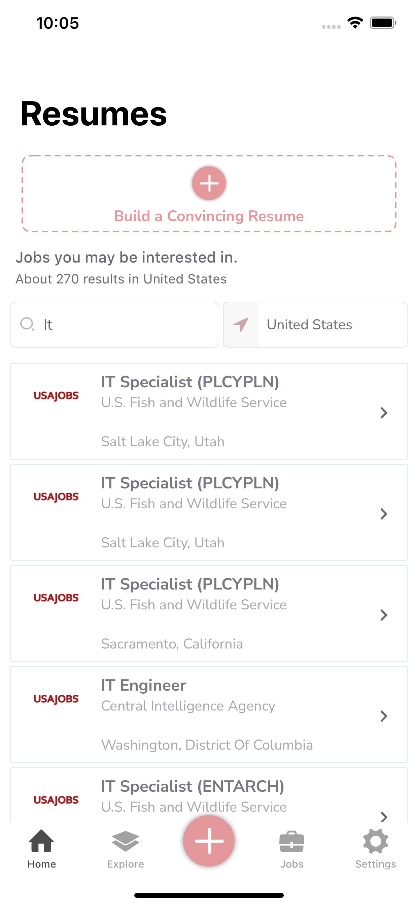
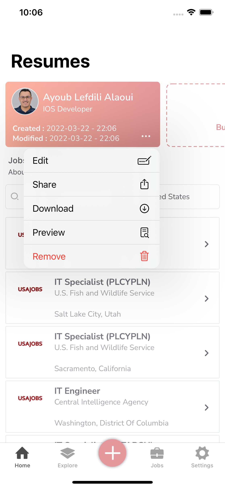
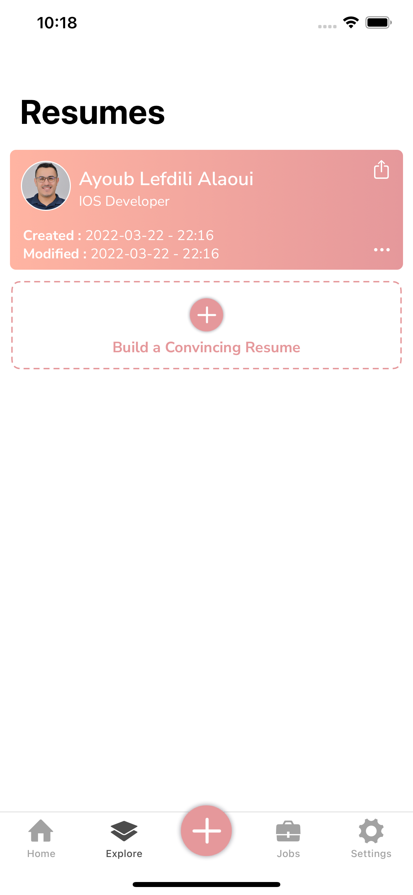
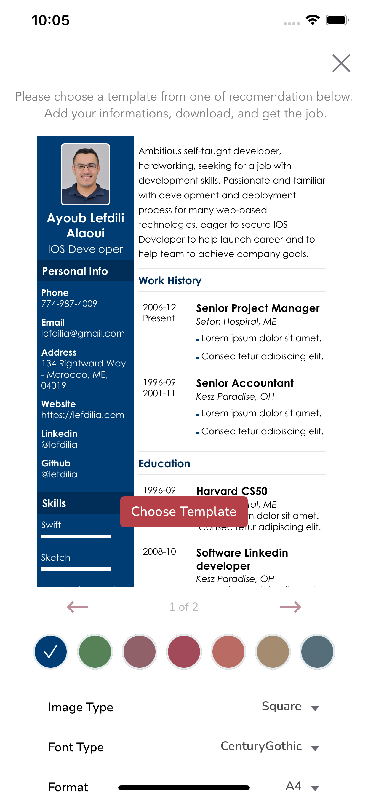
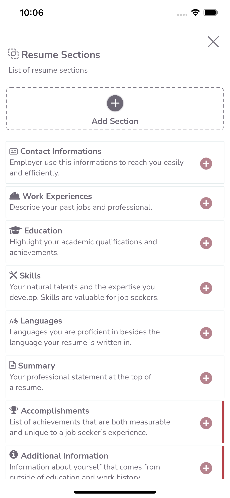
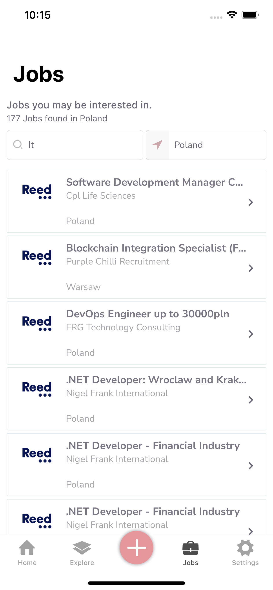
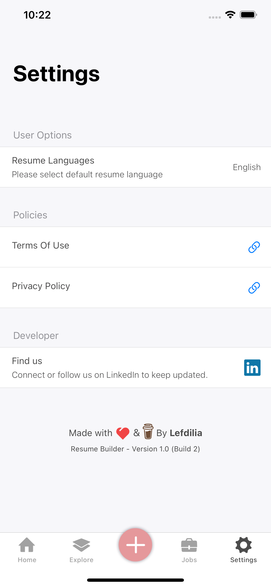

# PDF Resume Builder
 

 
 

**PDF Resume Builder** is Free iOS app that provides users with interactive forms and templates for creating a resume quickly and easily, It's THAT easy to use, even if you've never made a resume in your life before!

## 🚨 Features 🚨
- Our app will save you time creating your resume, just choose a template, and fill the sections
- Download the finished document to share it during your application process or save it in PDF format.
- Search for a job directly from the app, through famous API's like **‘Reed UK'**, **'USA Jobs’**, …
- **Pre Made summaries** base on field (fetched from remote server) [Updated]

## 🖥 Technology & Framework used: (For dear developers)

     IOS Support (iOS 13.0, *)

- **UIKit :** Programaticaly, No Storyboard or Xib used
- **Core-data :** Managing persistent data
- **Architecture Pattern** : MVP
- **URLSession** : Fetching Api's & remote summaries
- **TableView / CollectionView** Almost all over the Project 
- **Push Notifications** Firebase Cloud Messaging 
- **No external Modules used, except Firebase for Push-Notification (Via Swift Package Manager)**
- App Design is made on **`Sketch`** (The link below the post)

## 🎉 Updates: 

**On the next updates we will add a lot of features: Based on feedbacks ❤️**

- New Job Sources
- Add extra resume templates
- Add Cover Letters
- Pre made cover letters (Greeting, Letter Body, ...) **[Fetched from remote server]**

## App design (Sketch)

## App Store

## 🕹App Preview
https://user-images.githubusercontent.com/17814540/166395607-1d6e1460-8907-4c4d-a004-7b74bac68ccf.mp4

## 📱Screenshots

 
&nbsp;&nbsp;&nbsp;
&nbsp;&nbsp;&nbsp;  
&nbsp;&nbsp;&nbsp;
&nbsp;&nbsp;&nbsp;  
&nbsp;&nbsp;&nbsp;
&nbsp;&nbsp;&nbsp;  
&nbsp;&nbsp;&nbsp;
&nbsp;&nbsp;&nbsp;  
&nbsp;&nbsp;&nbsp;
&nbsp;&nbsp;&nbsp;

&nbsp;

&nbsp;

